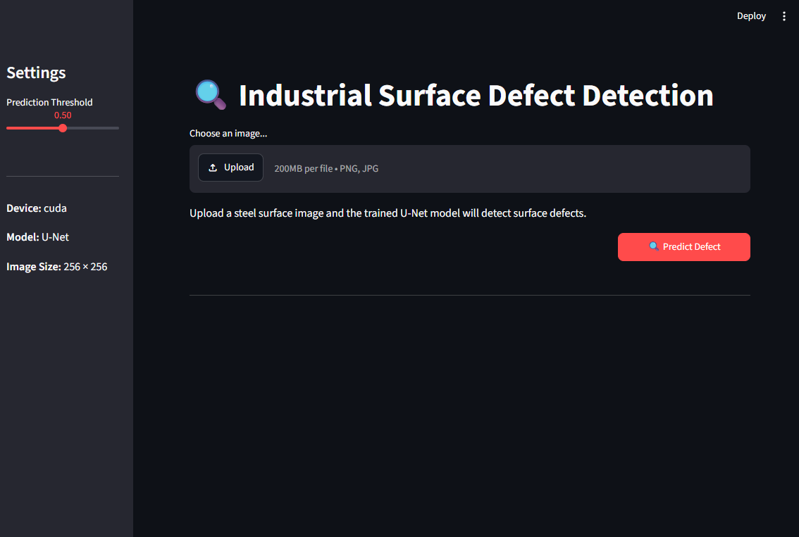

# Industrial Surface Defect Detection using U-Net

## Overview

This project implements an end-to-end deep learning pipeline for industrial surface defect detection using a U-Net semantic segmentation model trained on the KolektorSDD2 dataset.

The project includes:

- U-Net implementation in PyTorch
- Custom Dataset class
- Training & validation pipeline
- Dice Score & IoU evaluation
- Inference module
- Streamlit web application

---

## Dataset

Dataset: KolektorSDD2

Download:
https://www.vicos.si/resources/kolektorsdd2/

Place the dataset inside:

data/
└── KolektorSDD2/

---

## Project Structure

```text
industrial_surface_defect_detection/
├── app.py
├── config.py
├── model.py
├── dataset.py
├── inference.py
├── utils.py
├── models/
├── notebooks/
└── data/
```

---

## Model

Architecture:
- U-Net
- Binary Segmentation
- BCEWithLogitsLoss
- Adam Optimizer

---

## Results

Average Test Loss: 0.0142

Average Dice Score: 0.3354

Average IoU Score: 0.3245

---

## Streamlit App

Features

- Upload image
- Predict defect mask
- Overlay visualization
- Threshold slider


---

## Installation

```bash
git clone <repo>

cd industrial_surface_defect_detection

pip install -r requirements.txt
```

---

## Run Streamlit

```bash
streamlit run app.py
```

---

## Technologies

- Python
- PyTorch
- OpenCV
- Streamlit
- NumPy
- Matplotlib